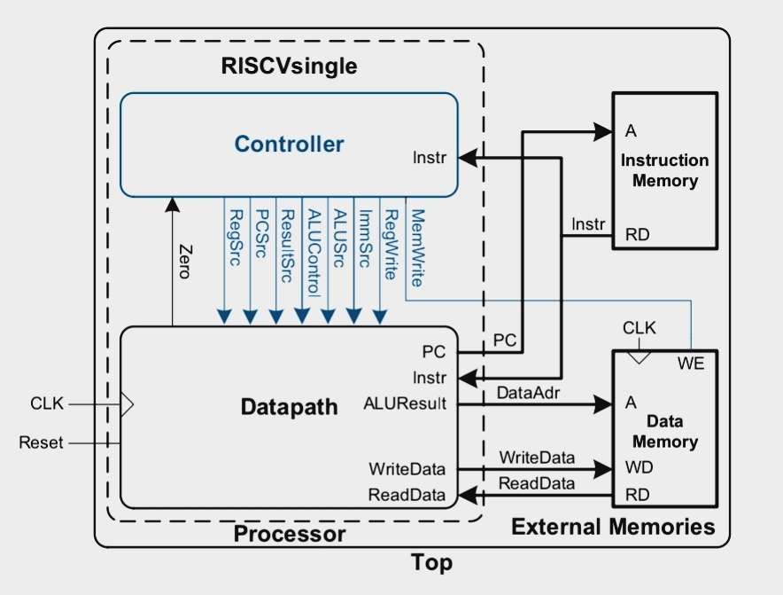

# Single-Cycle RISC-V Processor

A fully functional single-cycle RISC-V (RV32I) processor implemented in Verilog, targeting Xilinx Artix-7 Basys3 FPGA board.

---

## Table of Contents

- [Overview](#overview)
- [Architecture](#architecture)
- [Instruction Set](#instruction-set)
- [File Structure](#file-structure)
- [Module Description](#module-description)
- [Control Signals](#control-signals)
- [Execution Summary](#execution-summary)
- [Known Limitations](#known-limitations)
- [References](#references)

---

## Overview

A hardware implementation of a **RISC-V (RV32I)** processor designed in Verilog HDL. This project targets the **Digilent Basys3 (Xilinx Artix-7)** FPGA board, featuring a 7-segment display. 

The "Single-Cycle" architecture means that the every instruction - Fetch, Decode, Execute, Memory Access and Write-back - is performed within one clock cycle. 

---

## Architecture



---

## Instruction Set

### R-type (Register Type, opcode 0110011)
Arithmatic and Logic Operation

| Instruction | Operation |
|-------------|-----------|
| `add`  | rd = rs1 + rs2 |
| `sub`  | rd = rs1 − rs2 |
| `and`  | rd = rs1 & rs2 |
| `or`   | rd = rs1 \| rs2 |
| `xor`  | rd = rs1 ^ rs2 |
| `sll`  | rd = rs1 << rs2[4:0] |
| `srl`  | rd = rs1 >> rs2[4:0] (logical) |
| `sra`  | rd = rs1 >> rs2[4:0] (arithmetic) |
| `slt`  | rd = (rs1 < rs2) signed ? 1 : 0 |
| `sltu` | rd = (rs1 < rs2) unsigned ? 1 : 0 |

### I-type (Immediate type, opcode 0010011)
Immediate Arithmatic and Logic Operation

| Instruction | Operation |
|-------------|-----------|
| `addi`  | rd = rs1 + imm |
| `andi`  | rd = rs1 & imm |
| `ori`   | rd = rs1 \| imm |
| `xori`  | rd = rs1 ^ imm |
| `slti`  | rd = (rs1 < imm) signed ? 1 : 0 |
| `slli`  | rd = rs1 << shamt |
| `srli`  | rd = rs1 >> shamt (logical) |
| `srai`  | rd = rs1 >> shamt (arithmetic) |

<!-- shamt: Shift Amount -->

### Load / Store

| Instruction | Operation |
|-------------|-----------|
| `lw` | rd = mem[rs1 + imm] (32-bit word) |
| `sw` | mem[rs1 + imm] = rs2 |

### Branch (opcode `1100011`)
 
| Instruction | Condition |
|-------------|-----------|
| `beq`  | branch if rs1 == rs2 |
| `bne`  | branch if rs1 != rs2 |
| `blt`  | branch if rs1 < rs2 (signed) |
| `bge`  | branch if rs1 >= rs2 (signed) |

### Jumps and Upper Immediates
 
| Instruction | Operation |
|-------------|-----------|
| `jal`   | rd = PC+4; PC = PC + J-imm |
| `jalr`  | rd = PC+4; PC = (rs1 + I-imm) & ~1 |
| `lui`   | rd = imm << 12 |
| `auipc` | rd = PC + (imm << 12) |

---

## File structure

```
Single_Cycle_RISC_V_Processor/
├── Constraint_FIles/
│   └── basys3.xdc
├── README.md
├── Source_Files/
│   ├── alu.v
│   ├── alu_control.v
│   ├── branch_control.v
│   ├── control_unit.v
│   ├── data_mem.v
│   ├── imm_gen.v
│   ├── instr_mem.v
│   ├── program.hex
│   ├── register_file.v
│   ├── riscv_top.v
│   └── seg7_display.v
├── TestBenches/
│   ├── tb_alu.v
│   ├── tb_alu_control.v
│   ├── tb_branch_control.v
│   ├── tb_control_unit.v
│   ├── tb_data_mem.v
│   ├── tb_imm_gen.v
│   ├── tb_instr_mem.v
│   ├── tb_reg_file.v
│   └── tb_riscv.v
├── VCDFiles/
│   ├── alu_control_op
│   ├── alu_control_op.vcd
│   ├── alu_op
│   ├── alu_op.vcd
│   ├── branch_control_op
│   ├── branch_control_op.vcd
│   ├── control_unit_op
│   ├── control_unit_op.vcd
│   ├── data_mem_op
│   ├── data_mem_op.vcd
│   ├── imm_gen_op
│   ├── imm_gen_op.vcd
│   ├── instr_mem_op
│   ├── instr_mem_op.vcd
│   ├── register_file_op
│   ├── register_file_op.vcd
│   ├── riscv_top_op
│   └── riscv_top_op.vcd
└── images/
    └── RISCV_blockDiagram.jpeg
``` 

---

## Module Description

### `risc.v` : Top level

The top-module that connects all other modules into a working processor. It holds the PC register, computes `pc_plus4` and `pc_next`, and wires up the fetch -> decode -> execute -> memory -> writeback path. 
The PC updates on every clock edge; the write-back MUX selects between ALU result, memory data, or `pc+4` depending on the instruction type.

### `instr_mem.v` - Instruction Memory

A Read-Only Memory (ROM) that holds the program. At startup it loads `program.hex` using `$readmemh`. It takes the current PC as an address and outputs the 32-bit instruction for that address. The bottom two address bits are ignored since instructions are always 4-byte aligned. Uninitialized locations default to `NOP (0x00000013)`.

### `data_mem.v` — Data memory
 
A 256-word read/write random-Access Memory (RAM) used by `lw` and `sw` instructions. Writes happen on the rising clock edge when `mem_write` is high. Reads are combinational — the data appears immediately when `mem_read` is high. All locations are initialized to zero at startup.

### `register_file.v` — Register file
 
Holds the 32 general-purpose registers (`x0`–`x31`), each 32 bits wide. Provides two read ports (`rs1`, `rs2`) that return values immediately, and one write port (`rd`) that updates on the clock edge when `reg_write` is high. Register `x0` always reads as zero and ignores any writes to it.

### `alu.v` — ALU
 
Takes two 32-bit operands and a 4-bit control signal, and produces a 32-bit result plus a `zero` flag. Supports ADD, SUB, AND, OR, XOR, SLL, SRL, SRA, SLT, SLTU, and a pass-through for the LUI upper immediate.

| `alu_ctrl` | Operation |
|-----------|-----------|
| `0000` | AND |
| `0001` | OR |
| `0010` | ADD |
| `0110` | SUB |
| `0111` | SLT (signed) |
| `1000` | XOR |
| `1001` | SRL |
| `1010` | SRA |
| `1011` | SLL |
| `1100` | SLTU (unsigned) |
| `1101` | Pass B (LUI) |

### `alu_control.v` — ALU control decoder
 
A small combinational decoder that sits between the control unit and the ALU. It takes a 2-bit `alu_op` (set by the control unit based on instruction type), `funct3`, and `funct7[5]`, and outputs the 4-bit `alu_ctrl` signal. For example, `alu_op=10` with `funct3=000` and `funct7[5]=1` selects SUB; with `funct7[5]=0` it selects ADD.
 
### `control_unit.v` — Control unit
 
Looks at the 7-bit opcode and drives all the datapath control signals for that instruction type. Outputs: `reg_write`, `alu_src`, `mem_write`, `mem_read`, `mem_to_reg`, `branch`, `jump`, `jalr`, and `alu_op`. All signals default to 0; only the relevant ones are asserted per instruction.

| Opcode | Instruction type | Key signals asserted |
|--------|-----------------|----------------------|
| `0110011` | R-type | `reg_write`, `alu_op=10` |
| `0010011` | I-type arithmetic | `reg_write`, `alu_src`, `alu_op=10` |
| `0000011` | Load | `reg_write`, `alu_src`, `mem_read`, `mem_to_reg` |
| `0100011` | Store | `alu_src`, `mem_write` |
| `1100011` | Branch | `branch`, `alu_op=01` |
| `0110111` | LUI | `reg_write`, `alu_src`, `alu_op=11` |
| `0010111` | AUIPC | `reg_write`, `alu_src`, `alu_op=10` |
| `1101111` | JAL | `reg_write`, `jump` |
| `1100111` | JALR | `reg_write`, `alu_src`, `jalr` |

### `branch_control.v` — Branch control
 
Decides whether a branch instruction actually jumps. It checks the `branch` signal from the control unit, then uses `funct3` to pick the branch type (BEQ, BNE, BLT, BGE, BLTU, BGEU) and evaluates the ALU `zero` flag or `alu_result[0]` to produce the single `pc_branch` output. If `pc_branch` is high, the PC MUX selects the branch target instead of `pc+4`.
 
### `imm_gen.v` — Immediate generator
 
Extracts the immediate value embedded in the instruction and sign-extends it to 32 bits. The bit layout differs for each instruction format, so this module switches on the opcode to reassemble the correct bits.

| Format | Instructions | Bits used |
|--------|-------------|-----------|
| I-type | `addi`, `lw`, `jalr` | `instr[31:20]` |
| S-type | `sw` | `instr[31:25]`, `instr[11:7]` |
| B-type | branches | `instr[31]`, `[7]`, `[30:25]`, `[11:8]` |
| U-type | `lui`, `auipc` | `instr[31:12]` shifted left 12 |
| J-type | `jal` | `instr[31]`, `[19:12]`, `[20]`, `[30:21]` |

### `seg7_display.v` — 7-segment display
 
Shows the lower 16 bits of `x10 (a0)` as four hex digits on the Basys3 display. Each digit drives `an[3:0]` (active-low digit select) and `seg[6:0]` (active-low segment pattern).

---

## Control Signals

| Signal | Meaning | Asserted by |
|--------|---------|-------------|
| `reg_write` | Write enable for register file | R-type, I-arith, load, LUI, AUIPC, JAL, JALR |
| `mem_write` | Write enable for data memory | SW |
| `mem_read` | Read enable for data memory | LW |
| `alu_src` | ALU B-input selects immediate | I-arith, load, store, LUI, AUIPC, JALR |
| `branch` | Instruction is a branch type (BEQ/BNE/BLT/BGE) | branch opcode |
 
ALU control is derived combinationally from `funct3`, `funct7[5]`, and the instruction type - no separate ALU decoder module is needed.

---

## Execution summary
 
| PC | Hex | Assembly | x10 after | Display |
|----|-----|----------|-----------|---------|
| `0x00` | `01E00093` | `addi x1, x0, 30`   | —    | — |
| `0x04` | `00A00113` | `addi x2, x0, 10`   | —    | — |
| `0x08` | `00208533` | `add  x10, x1, x2`  | `40 (0x28)` | `0028` |
| `0x0C` | `40208533` | `sub  x10, x1, x2`  | `20 (0x14)` | `0014` |
| `0x10` | `0020F533` | `and  x10, x1, x2`  | `10 (0x0A)` | `000A` |
| `0x14` | `0020E533` | `or   x10, x1, x2`  | `30 (0x1E)` | `001E` |
| `0x18` | `0020C533` | `xor  x10, x1, x2`  | `20 (0x14)` | `0014` |
| `0x1C` | `0020A533` | `slt  x10, x1, x2`  | `0  (0x00)` | `0000` |
| `0x20` | `00A52023` | `sw   x10, 0(x10)`  | `0  (0x00)` | `0000` |
| `0x24` | `00052503` | `lw   x10, 0(x10)`  | `0  (0x00)` | `0000` |
| `0x28` | `00A50463` | `beq  x10, x10, +8` | `0  (0x00)` | `0000` |
| `0x2C` | `06300513` | `addi x10, x0, 99`  | *(skipped)* | — |
| `0x30` | `03700513` | `addi x10, x0, 55`  | `55 (0x37)` | `0037` |
| `0x34` | `FEDCB537` | `lui  x10, 0xFEDCB` | `0xFEDCB000` | **`B000`** |
| `0x38` | `00000013` | `nop`               | `0xFEDCB000` | `B000` |
| `0x3C` | `00000013` | `nop`               | `0xFEDCB000` | `B000` |
 
---

## Known Limitations

- Only `lw` and `sw` (32-bit word) are implemented. Byte (`lb`/`sb`) and halfword (`lh`/`sh`) accesses are not supported.
- No exception or interrupt handling — illegal instructions are silently ignored.
- Instruction memory is limited to 256 words. Programs larger than this require increasing the `mem` array in `imem.v`.
- `beq x10, x10` (comparing a register to itself) always branches regardless of the register's value — use distinct source registers for meaningful branch tests.

---

## References

- Sarah L Harris & David Money Harris - *Digital Design and Computer Architecture RISC-V Edition*
- [Digilent Basys3 Reference Manual](https://digilent.com/reference/programmable-logic/basys-3/reference-manual)

---
