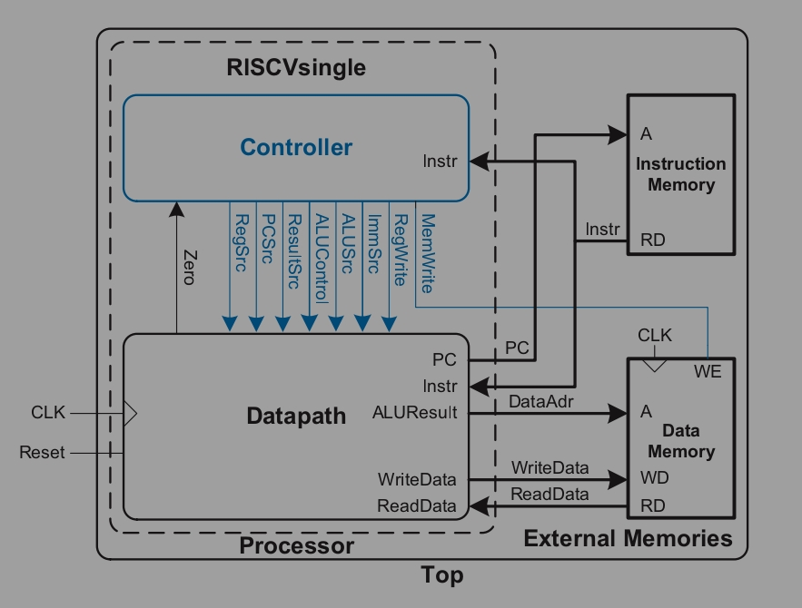

# Single-Cycle RISC-V Processor

A fully functional single-cycle RISC-V (RC32I) processor implemented in Verilog, targeting Xilinx Artix-7 Basys3 FGPA board.

## Table of Contents

- [Overview](#overview)
- [Architechture](#architechture)

## Overview

A hardware implementation of a **RISC-V (RV32I)** processor designed in Verilog HDL. This project targets the **Digilent Basys3 (Xilinx Artix-7)** FPGA board, featuring a 7-segment display. 

The "Single-Cycle" architecture means that the every instruction - Fetch, Decode, Execute, Memory Access and Write-back - is performed within one clock cycle. 

## Architechture

## INstruction Set

### R-type (Register Type, opcode 0110011)
Arithmatic and Logic Operation

| Instruction | Operation |
|-------------|-----------|
| `add`  | rd = rs1 + rs2 |
| `sub`  | rd = rs1 − rs2 |
| `and`  | rd = rs1 & rs2 |
| `or`   | rd = rs1 \| rs2 |
| `xor`  | rd = rs1 ^ rs2 |
| `sll`  | rd = rs1 << rs2[4:0] |
| `srl`  | rd = rs1 >> rs2[4:0] (logical) |
| `sra`  | rd = rs1 >> rs2[4:0] (arithmetic) |
| `slt`  | rd = (rs1 < rs2) signed ? 1 : 0 |
| `sltu` | rd = (rs1 < rs2) unsigned ? 1 : 0 |

